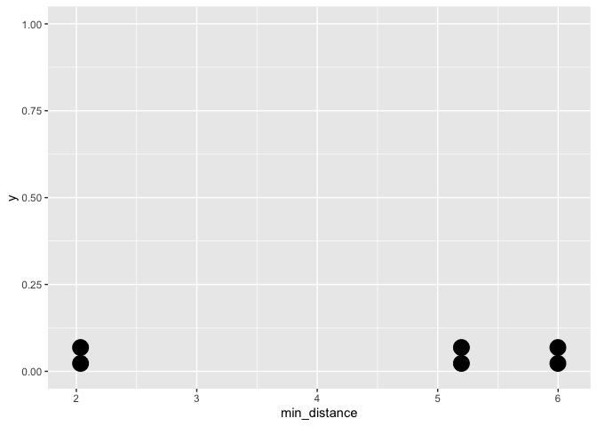
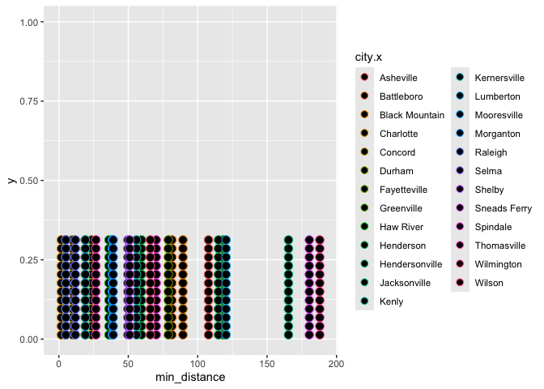
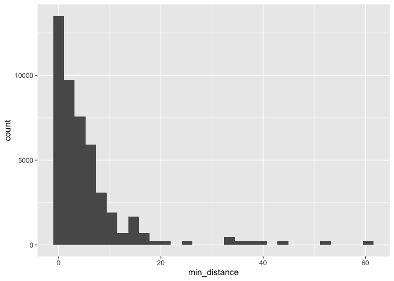
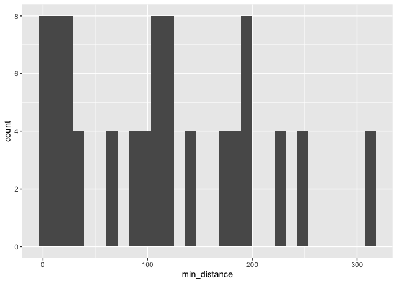

Lab 05 - Wrangling spatial data
================
Tiffani J. Hill
February 13, 2026

### Load packages and data

``` r
library(tidyverse) 
library(dsbox) 
library(readr)
library(ggridges)
```

``` r
states <- read_csv("data/states.csv")
source("Haversine.R")
```

### Exercise 1

There are 3 Denny’s restaurants and 2 La Quinta hotels in Alaska.

``` r
dn_ak <- dennys %>% 
  filter(state == "AK")
nrow(dn_ak)
```

    ## [1] 3

``` r
lq_ak <- laquinta %>% 
filter(state == "AK")
nrow(lq_ak)
```

    ## [1] 2

### Exercise 2

There are 6 pairings.

``` r
nrow(dn_ak)* nrow(lq_ak)
```

    ## [1] 6

### Exercise 3

``` r
dn_lq_ak <- full_join(dn_ak, lq_ak,
  by = "state"
)
```

    ## Warning in full_join(dn_ak, lq_ak, by = "state"): Detected an unexpected many-to-many relationship between `x` and `y`.
    ## ℹ Row 1 of `x` matches multiple rows in `y`.
    ## ℹ Row 1 of `y` matches multiple rows in `x`.
    ## ℹ If a many-to-many relationship is expected, set `relationship =
    ##   "many-to-many"` to silence this warning.

``` r
dn_lq_ak
```

    ## # A tibble: 6 × 11
    ##   address.x     city.x state zip.x longitude.x latitude.x address.y city.y zip.y
    ##   <chr>         <chr>  <chr> <chr>       <dbl>      <dbl> <chr>     <chr>  <chr>
    ## 1 2900 Denali   Ancho… AK    99503       -150.       61.2 3501 Min… "\nAn… 99503
    ## 2 2900 Denali   Ancho… AK    99503       -150.       61.2 4920 Dal… "\nFa… 99709
    ## 3 3850 Debarr … Ancho… AK    99508       -150.       61.2 3501 Min… "\nAn… 99503
    ## 4 3850 Debarr … Ancho… AK    99508       -150.       61.2 4920 Dal… "\nFa… 99709
    ## 5 1929 Airport… Fairb… AK    99701       -148.       64.8 3501 Min… "\nAn… 99503
    ## 6 1929 Airport… Fairb… AK    99701       -148.       64.8 4920 Dal… "\nFa… 99709
    ## # ℹ 2 more variables: longitude.y <dbl>, latitude.y <dbl>

…

### Exercise 4

There are 6 observations in this data frame. The variables are Address,
City, State, Zip code, Longitude and Latitude. …

### Exercise 5

Mutate

### Exercise 6

``` r
dn_lq_ak <- dn_lq_ak %>% 
  mutate(
    distance = haversine(
      longitude.x,
      latitude.x,
      longitude.y,
      latitude.y
    )
  )
```

### Exercise 7

``` r
dn_lq_ak <- dn_lq_ak %>% 
  group_by(latitude.x, longitude.x) %>% 
  mutate(
    min_distance = min(distance, na.rm = TRUE)
  ) %>% 
  ungroup()
```

\###Exercise 8

``` r
ggplot(dn_lq_ak, aes(x = min_distance,y=1)) +
       geom_dotplot()
```

    ## Bin width defaults to 1/30 of the range of the data. Pick better value with
    ## `binwidth`.

<!-- -->

``` r
summary(dn_lq_ak$min_distance)
```

    ##    Min. 1st Qu.  Median    Mean 3rd Qu.    Max. 
    ##   2.035   2.825   5.197   4.410   5.798   5.998

\###Exercise 9 I know I could have done a histogram here but that’s
boring so I would have added a company variable to the dataset to make
this more clear instead of using colors. Honestly, I really wanted to
play around with this type of graph.

``` r
dn_nc <- dennys %>% 
  filter(state == "NC")


lq_nc <- laquinta %>% 
filter(state == "NC")

dn_lq_nc <- full_join(dn_nc, lq_nc,
  by = "state"
)
```

    ## Warning in full_join(dn_nc, lq_nc, by = "state"): Detected an unexpected many-to-many relationship between `x` and `y`.
    ## ℹ Row 1 of `x` matches multiple rows in `y`.
    ## ℹ Row 1 of `y` matches multiple rows in `x`.
    ## ℹ If a many-to-many relationship is expected, set `relationship =
    ##   "many-to-many"` to silence this warning.

``` r
dn_lq_nc
```

    ## # A tibble: 336 × 11
    ##    address.x    city.x state zip.x longitude.x latitude.x address.y city.y zip.y
    ##    <chr>        <chr>  <chr> <chr>       <dbl>      <dbl> <chr>     <chr>  <chr>
    ##  1 1 Regent Pa… Ashev… NC    28806       -82.6       35.6 165 Hwy … "\nBo… 28607
    ##  2 1 Regent Pa… Ashev… NC    28806       -82.6       35.6 3127 Slo… "\nCh… 28208
    ##  3 1 Regent Pa… Ashev… NC    28806       -82.6       35.6 4900 Sou… "\nCh… 28217
    ##  4 1 Regent Pa… Ashev… NC    28806       -82.6       35.6 4414 Dur… "\nDu… 27707
    ##  5 1 Regent Pa… Ashev… NC    28806       -82.6       35.6 1910 Wes… "\nDu… 27713
    ##  6 1 Regent Pa… Ashev… NC    28806       -82.6       35.6 1201 Lan… "\nGr… 27407
    ##  7 1 Regent Pa… Ashev… NC    28806       -82.6       35.6 1607 Fai… "\nCo… 28613
    ##  8 1 Regent Pa… Ashev… NC    28806       -82.6       35.6 191 Cres… "\nCa… 27518
    ##  9 1 Regent Pa… Ashev… NC    28806       -82.6       35.6 2211 Sum… "\nRa… 27612
    ## 10 1 Regent Pa… Ashev… NC    28806       -82.6       35.6 1001 Aer… "\nMo… 27560
    ## # ℹ 326 more rows
    ## # ℹ 2 more variables: longitude.y <dbl>, latitude.y <dbl>

``` r
dn_lq_nc <- dn_lq_nc %>% 
  mutate(
    distance = haversine(
      longitude.x,
      latitude.x,
      longitude.y,
      latitude.y
    )
  )

dn_lq_nc <- dn_lq_nc %>% 
  group_by(latitude.x, longitude.x) %>% 
  mutate(
    min_distance = min(distance, na.rm = TRUE)
  ) %>% 
  ungroup()

ggplot(dn_lq_nc, aes(x = min_distance, y = 1, color = city.x, city.y)) +
       geom_dotplot()
```

    ## Bin width defaults to 1/30 of the range of the data. Pick better value with
    ## `binwidth`.

<!-- -->

``` r
summary(dn_lq_nc$min_distance)
```

    ##    Min. 1st Qu.  Median    Mean 3rd Qu.    Max. 
    ##   1.779  22.388  53.456  65.444  93.985 187.935

\##Exercise 10

``` r
dn_tx <- dennys %>% 
  filter(state == "TX")


lq_tx <- laquinta %>% 
filter(state == "TX")

dn_lq_tx <- full_join(dn_tx, lq_tx,
  by = "state"
)
```

    ## Warning in full_join(dn_tx, lq_tx, by = "state"): Detected an unexpected many-to-many relationship between `x` and `y`.
    ## ℹ Row 1 of `x` matches multiple rows in `y`.
    ## ℹ Row 1 of `y` matches multiple rows in `x`.
    ## ℹ If a many-to-many relationship is expected, set `relationship =
    ##   "many-to-many"` to silence this warning.

``` r
dn_lq_tx
```

    ## # A tibble: 47,400 × 11
    ##    address.x    city.x state zip.x longitude.x latitude.x address.y city.y zip.y
    ##    <chr>        <chr>  <chr> <chr>       <dbl>      <dbl> <chr>     <chr>  <chr>
    ##  1 120 East I-… Abile… TX    79601       -99.6       32.4 3018 Cat… "\nAb… 79606
    ##  2 120 East I-… Abile… TX    79601       -99.6       32.4 3501 Wes… "\nAb… 79601
    ##  3 120 East I-… Abile… TX    79601       -99.6       32.4 14925 La… "\nAd… 75254
    ##  4 120 East I-… Abile… TX    79601       -99.6       32.4 909 East… "\nAl… 78516
    ##  5 120 East I-… Abile… TX    79601       -99.6       32.4 2400 Eas… "\nAl… 78332
    ##  6 120 East I-… Abile… TX    79601       -99.6       32.4 1220 Nor… "\nAl… 75013
    ##  7 120 East I-… Abile… TX    79601       -99.6       32.4 1165 Hwy… "\nAl… 76009
    ##  8 120 East I-… Abile… TX    79601       -99.6       32.4 880 Sout… "\nAl… 77511
    ##  9 120 East I-… Abile… TX    79601       -99.6       32.4 1708 Int… "\nAm… 79103
    ## 10 120 East I-… Abile… TX    79601       -99.6       32.4 9305 Eas… "\nAm… 79118
    ## # ℹ 47,390 more rows
    ## # ℹ 2 more variables: longitude.y <dbl>, latitude.y <dbl>

``` r
dn_lq_tx <- dn_lq_tx %>% 
  mutate(
    distance = haversine(
      longitude.x,
      latitude.x,
      longitude.y,
      latitude.y
    )
  )

dn_lq_tx <- dn_lq_tx %>% 
  group_by(latitude.x, longitude.x) %>% 
  mutate(
    min_distance = min(distance, na.rm = TRUE)
  ) %>% 
  ungroup()

ggplot(dn_lq_tx, aes(x = min_distance)) +
       geom_histogram()
```

    ## `stat_bin()` using `bins = 30`. Pick better value `binwidth`.

<!-- -->

``` r
summary(dn_lq_tx$min_distance)
```

    ##    Min. 1st Qu.  Median    Mean 3rd Qu.    Max. 
    ##  0.0160  0.7305  3.3715  5.7918  6.6303 60.5820

\###Exercise 11

``` r
dn_mi <- dennys %>% 
  filter(state == "MI")


lq_mi <- laquinta %>% 
filter(state == "MI")

dn_lq_mi <- full_join(dn_mi, lq_mi,
  by = "state"
)
```

    ## Warning in full_join(dn_mi, lq_mi, by = "state"): Detected an unexpected many-to-many relationship between `x` and `y`.
    ## ℹ Row 1 of `x` matches multiple rows in `y`.
    ## ℹ Row 1 of `y` matches multiple rows in `x`.
    ## ℹ If a many-to-many relationship is expected, set `relationship =
    ##   "many-to-many"` to silence this warning.

``` r
dn_lq_mi
```

    ## # A tibble: 88 × 11
    ##    address.x    city.x state zip.x longitude.x latitude.x address.y city.y zip.y
    ##    <chr>        <chr>  <chr> <chr>       <dbl>      <dbl> <chr>     <chr>  <chr>
    ##  1 3310 Washte… Ann A… MI    48104       -83.7       42.3 41211 Fo… "\nCa… 48187
    ##  2 3310 Washte… Ann A… MI    48104       -83.7       42.3 30847 Fl… "\nRo… 48174
    ##  3 3310 Washte… Ann A… MI    48104       -83.7       42.3 12888 Re… "\nSo… 48195
    ##  4 3310 Washte… Ann A… MI    48104       -83.7       42.3 45311 Pa… "\nUt… 48315
    ##  5 4785 Beckle… Battl… MI    49015       -85.2       42.3 41211 Fo… "\nCa… 48187
    ##  6 4785 Beckle… Battl… MI    49015       -85.2       42.3 30847 Fl… "\nRo… 48174
    ##  7 4785 Beckle… Battl… MI    49015       -85.2       42.3 12888 Re… "\nSo… 48195
    ##  8 4785 Beckle… Battl… MI    49015       -85.2       42.3 45311 Pa… "\nUt… 48315
    ##  9 2033 Rawson… Belle… MI    48111       -83.5       42.2 41211 Fo… "\nCa… 48187
    ## 10 2033 Rawson… Belle… MI    48111       -83.5       42.2 30847 Fl… "\nRo… 48174
    ## # ℹ 78 more rows
    ## # ℹ 2 more variables: longitude.y <dbl>, latitude.y <dbl>

``` r
dn_lq_mi <- dn_lq_mi %>% 
  mutate(
    distance = haversine(
      longitude.x,
      latitude.x,
      longitude.y,
      latitude.y
    )
  )

dn_lq_mi <- dn_lq_mi %>% 
  group_by(latitude.x, longitude.x) %>% 
  mutate(
    min_distance = min(distance, na.rm = TRUE)
  ) %>% 
  ungroup()

ggplot(dn_lq_mi, aes(x = min_distance)) +
       geom_histogram()
```

    ## `stat_bin()` using `bins = 30`. Pick better value `binwidth`.

<!-- -->

``` r
summary(dn_lq_mi$min_distance)
```

    ##    Min. 1st Qu.  Median    Mean 3rd Qu.    Max. 
    ##   1.843  21.596 111.540 113.100 185.825 312.520

In a few states, Mitch Hedberg’s joke appears to hold some validity like
Texas and Alaska. However, it is not the case for all states. Looking at
the summary statistics and visualizations for four different states the
minimum distances vary quite a bit.
